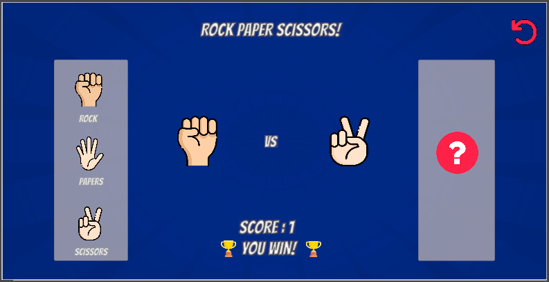

# 🪨📄✂️ Rock Paper Scissors (Unity 2D)

A simple 2D Rock-Paper-Scissors game built in Unity `2023.2.12f1`.

## 🎮 Features
- Player selects Rock, Paper, or Scissors via interactive 2D buttons
- Computer randomly chooses its move
- Display shows winner with basic visual feedback
- UI-based layout, minimal 3D assets

## 🛠️ Tech Stack
- Unity 2023.2.12f1
- C# scripting
- Unity UI Toolkit / Canvas (2D layout)

## 🚀 How to Play
- Click on Rock, Paper, or Scissors
- Wait for computer's choice
- View the result (Win, Lose, Draw)

## 📁 Project Structure
- `Assets/` — Game scripts and UI elements
- `ProjectSettings/` — Unity-specific configurations
- `.gitignore` — Prevents unnecessary Unity-generated files from bloating the repo

## 📷 Screenshot (Add your image)

---

> Created with ❤️ by [@mayankkapadi](https://github.com/mayankkapadi)
